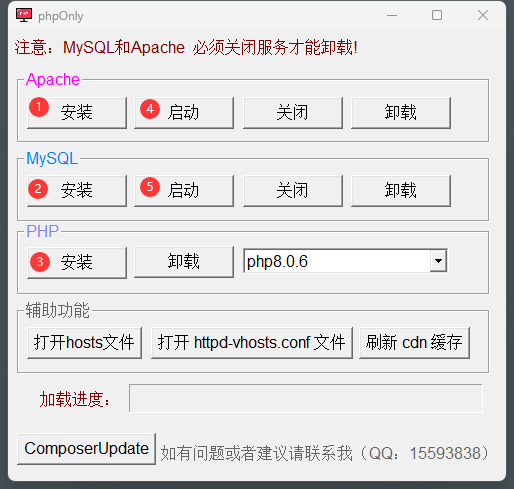

# phpOnly
# 一、简介

欢迎您使用 phpOnly 集成开发环境

phpOnly 是基于 `PowerBuilder` 语言开发的 php 开发环境，集成了 apache、mysql、php 等环境

> 主要用于 PHP 语言使用，可以作为本地开发环境，也可做为服务器环境

**Github**

> 项目地址：https://github.com/Zisays/phpOnly（ 优先更新，推荐 Star ⭐ ）

**码云：**

> 项目地址：https://gitee.com/zisay/TkApi 	（ 国内访问速度快 ）

若您有任何疑问或建议反馈，都可以通过以下方式联系到我，我非常愿意倾听您的建议与观点！

> QQ：15593838 
>
> Email：zisayzhang@outlook.com
>
> gmail：zisayzhang@gmail.com

**友情赞助**

1、支付宝（ 推荐 ）

 

2、微信

 

# 二、安装

## 1、软件运行库.exe

先按照软件运行库，确保电脑不会缺少 vc++ 这些运行库，安装完以后，`重启`一下电脑

## 2、安装 apache 和 mysql



如图所示，按照顺序操作

1. 安装 Apache
2. 安装 MySQL
3. 安装 PHP
4. 启动 Apache
5. 启动 MySQL


<p style='color:red'>注意：安装过程中可能会有以下报错</p>

**1、端口被占用**
phpOnly 中的 `apache` 的默认端口是 `8080` 端口
如果您的计算机中 `8080` 端口被占用，建议结束占用端口的程序，或者您也可以修改 `httpd.conf` 配置文件，将端口修改为其他端口。  

**2、查看 apache 错误命令**

```shell
httpd -k start  
```

**3、如果出现以下错误**  

```shell
(OS 10048)通常每个套接字地址(协议/网络地址/端口)只允许使用一次。 : AH00072: mak  
e_sock: could not bind to address [::]:443  

(OS 10048)通常每个套接字地址(协议/网络地址/端口)只允许使用一次。 : AH00072: mak  
e_sock: could not bind to address 0.0.0.0:443  

AH00451: no listening sockets available, shutting down  
AH00015: Unable to open logs  

windows下启动apache报make_sock: could not bind to address [::]:443错误！ 
```

> 是由于安装了虚拟机VMWare，被占用 443 端口  

解决方法：  

```
打开虚拟机VMware，打开菜单 编辑→首选项（Edit–> Preferences）  
点击共享虚拟机后，找到右边的更改设置，点击它  
在端口号处，输入444，点击确定，大功告成  
```

# 三、配置

## 1、配置 hosts 文件

> 可以通过 辅助功能 中的【打开 hosts 文件】按钮进行修改
>
> 也可以从 C:\Windows\System32\drivers\etc 目录下，找到 hosts 文件手动修改

打开 hosts 文件后，添加以下配置。

> 如果 hosts 文件中有次配置，则不用添加

```php
127.0.0.1 localhost
```

## 2、配置 httpd-vhosts.conf 文件

点击程序中的 【 打开 httpd-vhosts.conf 文件】，可以看到以下配置，此配置是默认配置，支持 localhost 访问

但是这个 `DocumentRoot` 路径是我电脑里的，你要修改成你的 `localhost` 项目文件路径，其他的就不用配置了

```php
<VirtualHost *:8080>
ServerAdmin zisayzhang@outlook.com
DocumentRoot "D:\phpOnly\www\localhost"
ServerName localhost
ServerAlias localhost
ErrorLog "logs/dummy-host2.example.com-error.log"
CustomLog "logs/dummy-host2.example.com-access.log" common
</VirtualHost>
```

## 3、域名配置（可选）

### （1）、hosts 

同上，只不过在修改 hosts 时修改为域名即可，例如

```php
127.0.0.1 www.zisay.cn
127.0.0.1 zisay.cn
```

### （2）、httpd-vhosts.conf

如果想要支持自定义域名，复制上述内容，简单的修改一下就好了

例如：

```php
<VirtualHost *:8080>
ServerAdmin zisayzhang@outlook.com
DocumentRoot "D:\phpOnly\www\www.zisay.cn"
ServerName www.zisay.cn
ServerAlias zisay.cn
ErrorLog "logs/dummy-host2.example.com-error.log"
CustomLog "logs/dummy-host2.example.com-access.log" common
</VirtualHost>
```

- ServerAdmin：管理员邮箱
- DocumentRoot：域名项目文件路径
- ServerName：主域名
- ServerAlias：子域名

# 四、访问

配置好 hosts 文件后，现在我们打开浏览器，输入 `localhost` 就可以看到 phpinfo() 界面了

**1、如果您要运行自己的项目**

只需要在 `phpOnly\www\localhost` 目录下，删除 `index.php` 文件，将您的 php 项目放进来，就可以运行了

**2、如果您配置了域名**

别忘了在 `phpOnly\www\` 目录下创建【域名项目文件夹】，不然也是不会生效的
